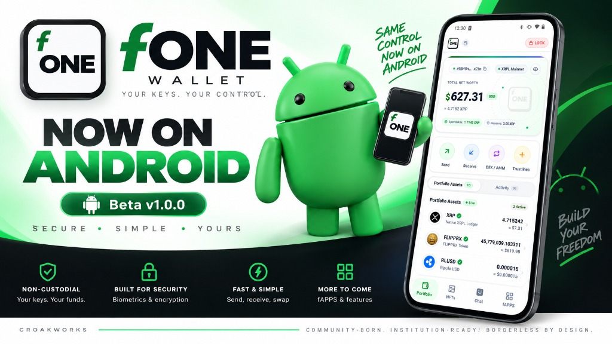
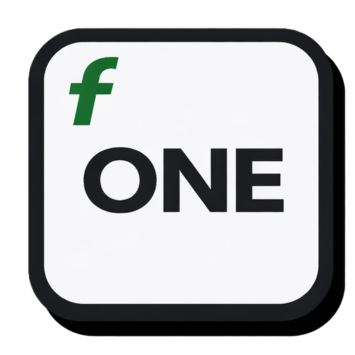

  

   
   

  

  # fONE — FLIPPRX Mobile

  **High-Security Native XRPL Mobile Wallet & Decentralized Super-App**

  
  
  
  
  
  

   

  

> [!NOTE]
> **Official Download Portal:** The latest Android Beta release is live and available directly at **[https://flipprx.one/fone](https://flipprx.one/fone)**. Official listings on the **Google Play Store** and **Apple iOS App Store** are **Coming Soon**!

---

## What is fONE?

**fONE** brings the speed, low transaction fees, and native utilities of the XRP Ledger to iOS and Android. Built with a focus on self-sovereignty, privacy, and tactile performance, fONE protects user assets with hardware-isolated cryptography while delivering a complete Web3 ecosystem directly to your pocket.

### Highlights
* **100% Non-Custodial:** Your keys, your crypto. Private keys never leave your phone's hardware security chip.
* **Hardware-Backed Protection:** Protected by Apple Secure Enclave (iOS) and Android StrongBox / TEE Keymaster.
* **Class 3 Biometric Security:** Face ID, Touch ID, or Fingerprint authentication + 6-digit salted PIN fallback.
* **Native AMM & DEX Swaps:** Trade native XRPL tokens directly on-ledger with customizable slippage protection.
* **XLS-20 NFT Hub & Music Player:** View NFT collections and stream high-fidelity audio NFTs via the embedded player.
* **MIMO On-Chain Encrypted Messaging:** Peer-to-peer wallet-to-wallet private chat powered directly by XRPL memos.
* **21 Native fApps:** Built-in decentralized tools including cross-chain bridges, point-of-sale terminals, limit orders, escrows, and checks.

---

## Version & Store Status

| Target | Current Status | Download / Action |
| :--- | :--- | :--- |
| **Android Beta (Direct APK)** | 🚀 **Live & Available** | [**Download APK (flipprx.one/fone)**](https://flipprx.one/fone) |
| **Google Play Store (Android)** | ⏳ **Coming Soon** | App Store submission in preparation |
| **Apple App Store (iOS)** | ⏳ **Coming Soon** | TestFlight & App Store review in progress |

---

## Repository Contents

This repository provides official consumer documentation, user guides, and licensing terms for fONE:

* 📖 **[DOCUMENTATION.md](./DOCUMENTATION.md)** — The complete, comprehensive user manual covering:
  * Security and privacy architecture
  * Portfolio & reserve management (Base Reserve & Owner Reserves)
  * Full catalog of all 21 native fApps
  * Supported account standards (BIP-39, Family Seeds, Xaman Secret Numbers)
  * First-time setup walkthrough & safety guidelines
  * Frequently Asked Questions (FAQ)
* ⚖️ **[LICENSE](./LICENSE)** — Proprietary licensing and copyright terms.

---

## Official Channels & Support

* **Official Download Portal:** [https://flipprx.one/fone](https://flipprx.one/fone)
* **Website & Ecosystem:** [croak.work](https://croak.work)
* **Support & Assistance:** admin@croak.work (or via the in-app Help & Support fApp)
* **Supported Networks:** XRPL Mainnet & Testnet
